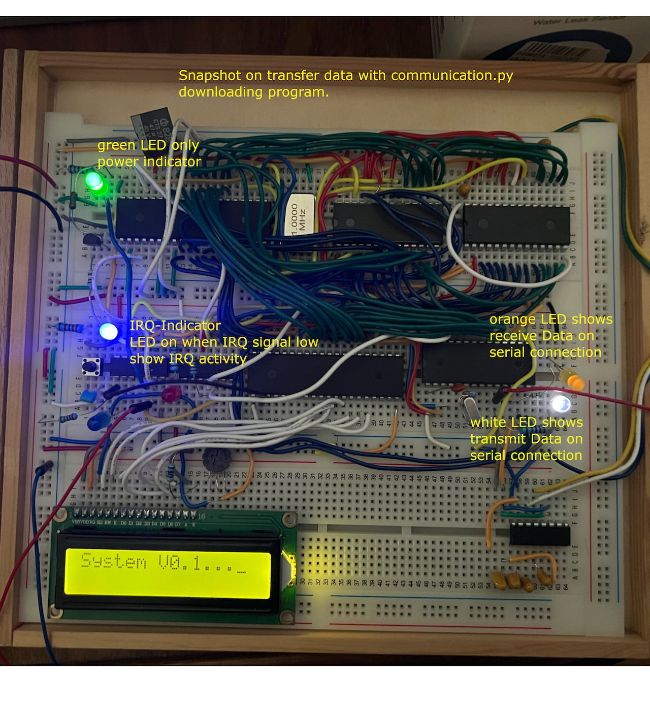
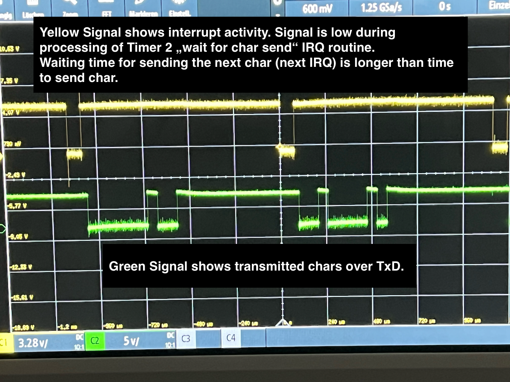
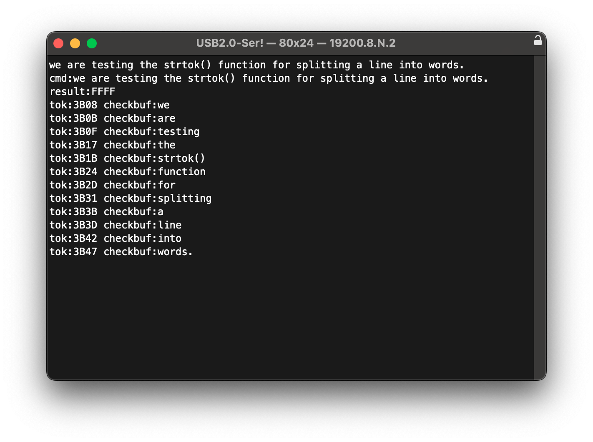

# beginning checkin:

ccpy65 is at the first place educational c-compiler for small 6502/65c02 Computers
like the Breadboard Computer from Ben Eater. I startet the project for fun some
years ago, but due to a lack of time, i am not able to extend functionality.

If you are interested in building a compiler you are welcome to improve the
project, learn something new ore even better, improve the functionality.

And there is a lot of improvement possible, because at the moment, there is only
a very very tiny subset of the c-language implemented. May be it is better to beginn
from the scratch then extending the existing compiler.

How To use the compiler:

1. I am using VSCODIUM for development on Win, Mac and Linux, see: https://vscodium.com/
2. For Using it, Clone the repository and open the folder with vscodium, or open the remote
   repository inside vscodium
3. adjust the file "launch.json" for the correct startaddress of your minicomputer, it is 0x200
   for execting in RAM and 0x8000 for burning the eeprom. 
               "args": ["--debug2", 
                     "-o", "test.s", 
                     "-I", "testfiles", 
                     "-I", "testfiles/expressions", 
                     "-I", "testfiles/usefulfunctions", 
                     "-I", "testfiles/programs", 
                     "-s", "0x3800", 
                     "-g", "0x2800", 
                     "-p", "0x0200",    <--  program start address 0x200 or 0x8000 
                     "monitor.c" 
                    ], 
4. Compile with Run/Debug from the Execute Tab
5. If no errors are present, the outputfile will be written to the repository under the name
   test.s, it is a 6502 assembler file for the vasm assembler from Volker Barthelmann and 
   Frank Wille. You need the vasm6502_oldstyle Version of the assembler. Ben Eater has a 
   Video on installing them on youtube.
6. Change to the asmtest folder and type make, this will compile the file test.s to a.out:
7. after downloading to your breadboard minicomputer or burning the eeprom, you can run the
   program.

At the moment, the original IO-Mapping from Ben Eaters Breadborad Computer was usded.

# IMPORTEND NOTICE! 
The Serial IO, i am using, has to be modified. You must connect the PIN 16 of the ACIA (DCD)
with Ground and the ACIA PIN 17 (DSR) with +5V. I am using interrupt driven IO for sending 
and receiving serial Data and if the receive interrupts of the ACIA 6551 are enabled, both 
PINs generate a IRQ if floating.  
Btw. Because of the Bug in the Send Logic of the 6551 i am using Timer 2 of the VIA 6522 for
the send timing of the serial interface. And Timer 1 is used for continues IRQ running a 
timer with usec accuracy for time measurement. 
You need a propper configured IRQ layout on your breadboard computer for running the system.

# Picture of the Breadboard computer
This is, of course, another Ben Eater Breadboard Computer with the 65C02. I added some LED to
have a little control over IRQ Status and Serial IO. 

(Picture of the Breadboard Computer with Status LED)

The picture was taken during transmitting a program with the communication.py script. So we have all kinds of
IO and a lot of IRQ, otherwise the LEDs are dark.

# Picture of IRQ and Data during send data
Because of the Bug in ACIA 6551 there was the need of a Timer 2 based send routine. For sending a char i 
decided to start Timer 2 in one shot mode, signalling the end of time with IRQ. The 6551 was also unable 
to handle IRQs in transmit mode because of the hardware bug.

The following picture shows this timing with an oszilloscope. I added additonal wait time because i had problems
reiceiving it error free. This may be is a problem with the receiver, but i don't know. With this adjustment
error rate was minimized.

(Picture of timing during send char routine)

# first output of the actual "monitor.c" program, (will change in the future)
At the time of first checkin, i added a screenshot of the program "monitor.c" from today (August 6th).
(Screenshot of running strtok test)

Michael   Sunday 6th August 2023
